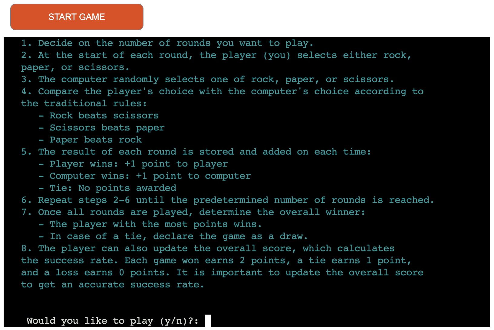
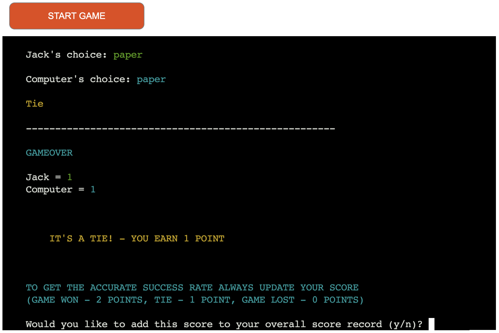
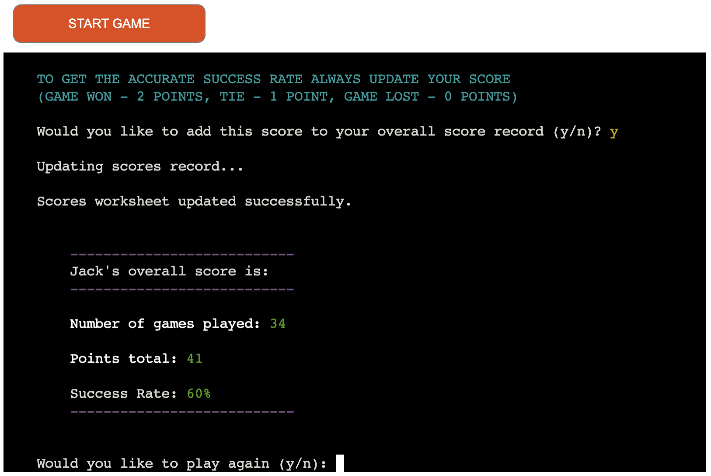
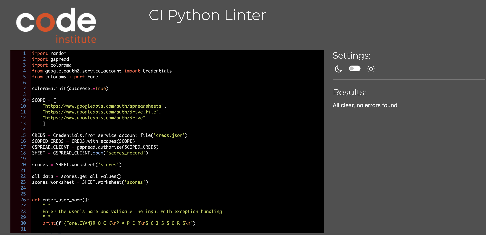

# Rock Paper Scissors

## Overview 

This is an implementation of the classic Rock Paper Scissors game in Python. The aim of the game is to beat the computer by choosing a gesture that defeats its choice based on the following rules: Rock crushes Scissors, Scissors cuts Paper, and Paper covers Rock. The game prompts the player to enter their choice and then randomly generates the computer's choice. It then compares both choices to determine the winner and displays the result. The player can play multiple rounds within one game and keep record of their scores as well as see their success rate of winning the game.

[live site](https://rock-paper-scissors-jth-58f83fceca79.herokuapp.com/)

## Table of Contents
1. [**Overview**](#overview) 
2. [**Planning**](#planning)
3. [**UX**](#ux)
4. [**Features**](#features)
5. [**Technologies**](#technologies)
6. [**Testing**](#testing)
    - [**Manual Features testing**](#features-testing) 
    - [**Bugs Resolved**](#bugs)
    - [**Python Validator Testing**](#validator-testing)
7.  [**Deployment**](#deployment)
8.  [**Credits**](#credits)

---

## Planning 

**Aim**

The aim of creating the Rock Paper Scissors game in Python for a user is to offer a simple, engaging, and interactive way to enjoy a classic game through a digital medium. It provides users with a quick and fun break, allowing them to play against the computer and test their luck and strategy. Additionally, the game serves as a practical demonstration of basic programming capabilities, potentially inspiring users to explore and learn more about coding and software development. By delivering an easy-to-use and entertaining application, it aims to enhance the user's experience with technology and gaming.

**Targeted Audience**

The targeted audience for the Rock Paper Scissors game includes casual gamers looking for quick entertainment. It is great for individuals interested in classic games and those who enjoy small, interactive applications that can be played in short bursts. The game appeals to a broad range of ages and skill levels, making it accessible and enjoyable for anyone with a few minutes to spare.

---

## UX 

**User Stories**
- As a user, I want to easily understand how to start and play the game.
- As a user, I want the option to play multiple rounds within one game.
- As a user, I want to input my choice of rock, paper, or scissors.
- As a user, I want the game to randomly generate the computer's choice.
- As a user, I want to see the result of each round, including both my choice and the computer's choice.
- As a user, I want to know if I won, lost, or if the game was a draw.
- As a user, I want to be able to exit the game easily when I am done playing.
- As a user, I want to know what my overall success rate is while playing the game.
- As a user, I want clear instructions and feedback throughout the game to enhance my playing experience.

**Design**

***Flowchart***

***Design Choices***

Due to this program being built for terminal use, there was limited design options. I used basic keyboard letters with different colours from Colorama.

---

## Features 

**Welcome Screen**

On the welcome screen the title of the game is displayed and the user is asked to enter their name 
UPDATE 

**Reading instructions option**

The user has an option to read the instructions or start the game. After the instructions are desplayed the user can chose to play or quit.

**Play Game**
The user is asked to chose how many rounds they want to play this game.
The user is asked to select option. The user's option and computer optio are displayed. Repeats until selected number of rounds

**Finish Game**

End of game. The winner is announced and the user is promped to update their score. It is important to update it each time they play so the success rate is accuratly calculated.

**Display current score**

The current score including the success rate is displayed
The user is asked if they want to play again

### Future Features
While the current version of the project is fully functional, I have some exciting features planned for future updates. Here are a few ideas that I didn't have time to implement in this release:
- Login system for keeping accurate score records: The app recognizes the user's name if it is already in the system (Google Spreadsheet).
- Adding additional visual effects for an improved user-friendly experience.
- Refactoring the code: Looking for more efficient code and eliminating any repeated blocks of code.

---

## Technologies 
- Python: The program was written entirely in Python.
- Github: Used to store the project's code after being pushed from Git.
- Gitpod: The terminal was used to commit my code and push it to Github.
- Git: Was used for version control through the vscode terminal.
- Heroku: Used to deploy, manage, and scale my application.
- Lucidchard: Used to create the flowchart

---

## Testing 

### Manual Features Testing 

| Section Tested | Input To Validate | Expected Outcome | Actual Outcome | Pass/Fail |
| -------------- | ----------------- | ---------------- | -------------- | --------- |
| Welcome screen |  n/a | Name of the game displayed. User asked to enter the name | As expected | Pass |
| Welcome screen |  J | Error message 'name must be at least 3 characters | As expected | Pass |
| Welcome screen |  Jay | Welcome to the game message and option to read instructions | As expected | | Pass |
| Welcome to the game and option to read instructions | 4 | Error message 'only 1 or 2 is valid'| As expected | Pass |
| Welcome to the game and option to read instructions | 2 | Game starts. Player asked to choose numebr of rounds| As expected | Pass |
| Welcome to the game and option to read instructions | 1 | Instructions displayed. Player asked to confirm if they want to play | As expected | Pass |
| Instructions displayed. Player asked to confirm if they want to play | yes | Error message 'only y or n is valid' | As expected | Pass |
| Instructions displayed. Player asked to confirm if they want to play | n | Exit game | As expected | Pass |
| Instructions displayed. Player asked to confirm if they want to play | y | Game starts. Player asked to choose numebr of rounds | As expected | Pass |
| Game starts. Player asked to choose numebr of rounds | 12 | Error message 'only numbers between 1 ands 8 are valid' | As expected | Pass |
| Game starts. Player asked to choose numebr of rounds | 4 | Player asked to select their choice: rock, paper, scissor | As expected | Pass |
| Player asked to select their choice: rock, paper, scissor | r | Error message 'only rock, paper, scissor are valid' | As expected | Pass |
| Player asked to select their choice: rock, paper, scissor | rock | Player's and computer's choice are shown. If more rounds are played, player is asked ot select their choice again | As expected | Pass |
| Final score* is displayed and winner announced. The player is prompted to update their overall score** | no | Error message 'only y or n is valid' | As expected | Pass |
| Final score* is displayed and winner announced. The player is prompted to update their overall score** | n | Overall score is displayed (without updating it). End of game. Player prompted to play again | As expected | Pass |
| Final score* is displayed and winner announced. The player is prompted to update their overall score** | y | The spreadsheet is updated. Overall score is displayed (without updating it). End of game. Player prompted to play again | As expected | Pass |
| Overall score is displayed (without updating it). End of game. Player prompted to play again | n/a | As expected | Pass |

*Final score is the score after a game (selected number of rounds). It is one of three options: player wins, computer wins, or tie. A player win earns 2 points, a tie earns 1 point, and a computer win earns 0 points.

**Overall score is the score recorded in the Google Spreadsheet. It includes the number of games, number of points, and success rate, calculated with the formula:
success rate = ((number_of_points)/(number_of_games_played * 2))*100

### Bugs Resolved 

**Introduction**
This section provides a summary of bugs that have been identified, reported, and subsequently resolved.

**Bug Tracking**
Below is a summary of resolved bugs:

| Bug ID | Bug Description | Status |
|--------|-----------------|--------|
| #001   | The row within the Google Spreadsheet was not updating | Resolved |
| #002   | The overall score is not user-friendly (displays as a dictionary) | Resolved |
 

**Bug Details**
Here are the details of the resolved bugs:

**Bug #01**
- **Description**:  The row within the Google Spreadsheet was not updating
- **Resolution**: After searching through the name column, I used the find() method to identify the cell coordinates. Then, I used the split() method to identify the row number. This allowed me to remove the existing row and add the new row
- **Impact**: The score record and success rate are now accurate

**Bug #02**
- **Description**:  The overall score is not user-friendly (displays as a dictionary)
- **Resolution**: I returned the headers and values rows as lists and used zip iteration to display them clearly
- **Impact**: The user can understand their overall score more easily

### Python Validator Testing 

I validated my files using Code Institute's Python Linter

---

## Deployment 

**Version Control**
I used Gitpod code editor to create my site and pushed to GitHub to the remote repository rock-paper-scissors.
The following git commands were used throughout development to push code to the remote repo:
- git add - This command was used to add the file(s) to the staging area before they are committed.
- git commit -m “commit message” - This command was used to commit changes to the local repository queue ready for the final step.
- git push - This command was used to push all committed code to the remote repository on github.

**Heroku Deployment**
Heroku provides a platform for hosting web applications, including those built using Python. I deployed my Python-based Rock Paper Scissors game on Heroku, making it accessible to users.

Steps I took to deploy my application in Heroku:
- Before deployment type pip3 freeze > requirements.txt for Heroku to install dependencies
- Cleate/set up/open Heroku account
- Create new app
- In Settings
    - Open Reveal Config Vars and add: 
        - CREDS as KEY, copy the content of creds.json into VALUE
        - PORT as KEY and 8000 as VALUE
    - Open Buildpacks and add: Python, nodejs
- In Deploy
    - Connect to GitHub and search for repository, then connect
    - Diploy Branch, main branck is selected for deployment
- Click view to see the deployed app

[live site](https://rock-paper-scissors-jth-58f83fceca79.herokuapp.com/)

**Forking in GitHub**
To create a personal copy of a public repository to contribute to a project or create your own version of it follow the steps below:
- Go to the GitHub repository you wish to fork
- Click the fork button on the top right corner of the chosen repository page
- After forking the repository, you will be redirected to your own version of the repository. This version is the same as the original.
- You can now make changes to the code, adding your own features, fix issues, or modify code within your fork. These changes do not affect the original repository.
- If you want to send your changes back to the owner, you can do so by creating a "Pull Request." They can review your changes and decide whether they want to add it to their repository.
---

## Credits  

**Code**
- I used some online video tutorial, such as [video 1](https://www.youtube.com/watch?v=fn68QNcatfo) or [video 2](https://www.youtube.com/watch?v=ruISjcokmuk), to understand the basic logic and structure of Rock Paper Scissors as designed using Python. These were used as inspiration only. All code is written by me, with some lines or short blocks of code adapted from these videos.

**Anknowledgements**
- Medale Oluwafemi, my mentor at Code Institute for his guidance and invaluable support with this project
- Tutor support at Code Institute for assisting me with solving problems and fixing bugs and errors